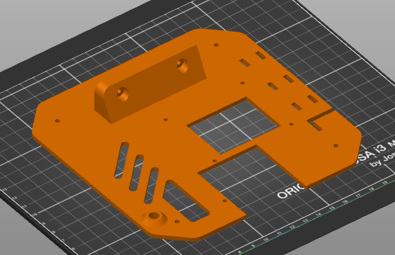
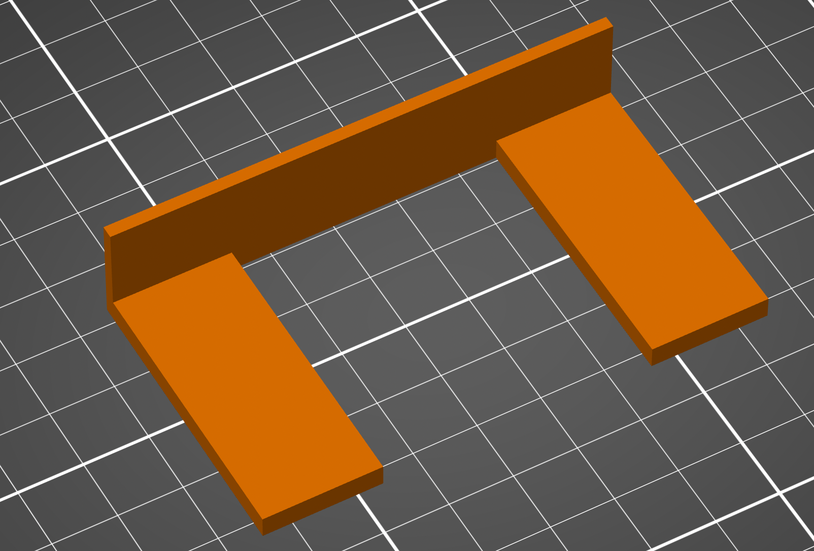

# 3D printing instructions

# 

You can get 3D files in STL format [here](./stl)

If you want to edit files, you can use [STEP files](./step) and import into your favourite CAD.

## bottom_plate *P01* ([file](./stl/bottom_plate.stl))

* top/bottom: 3 layers
* perimeters 1.2mm
* 0.4 extruder
* 0.2 z resolution
* no supports
* 10% infill
* grid infill

NOTE: It should be not an issue print holes in the bottom center area (caster mount) without supports.

## top_plate *P02* ([file](./stl/top_plate.stl))

* top/bottom: 3 layers
* perimeters 1.2mm
* 0.4 extruder
* 0.2 z resolution
* no supports
* 10% infill
* grid infill

NOTE: It should be not an issue print the hole in the bottom left area (antenna mount) without supports.

## battery_cover *P03* ([file](./stl/battery_cover.stl))

* top/bottom: 3 layers
* perimeters 1.2mm
* 0.4 extruder
* 0.2 z resolution
* no supports
* 10% infill
* grid infill

## moebiustech_spacer *P04* ([file](./stl/moebiustech_spacer.stl))

* top/bottom: 3 layers
* perimeters 1.2mm
* 0.4 extruder
* 0.2 z resolution
* no supports
* 20% infill
* grid infill

## dcdc_spacer *P05* ([file](./stl/dcdc_spacer.stl))

* top/bottom: 3 layers
* perimeters 1.2mm
* 0.4 extruder
* 0.2 z resolution
* no supports
* 20% infill
* grid infill

---

> ***Copyright © 2021 G. Bruno gbr1.github.io under MIT license***