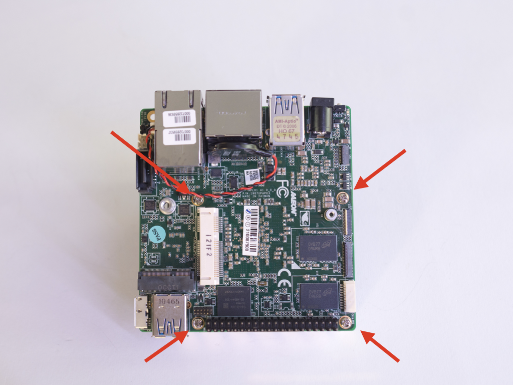

# UP Squared setup

# 

## 1. List of the component needed in following steps

- UP Squared (*code E01*)

- WiFi kit with antennas (*code E02*)

- AI Core X kit (*code E03*)

- 4x M2.5x20+6 standoffs (*code M01*), you can also build from smaller if you haven't got them

- 4x M2.5 nuts (*code M03*)

## 2. Prepare the UP Squared

1. You have to replace heatsink with standoffs 

2. Screw a nut on a standoff and replace the UP Squared screw. Continue in cross like in following photos

3. Bring the AI Core X kit and mount the module in the PCI-e socket

4. Fix the module sing the included screw

5. Bring the WiFi kit and insert in the M2 socket

6. Fix the WiFi card using the included screw

7. Bring the flexible PCB antenna and connect on port 2 of WiFi card

8. Mount the other antenna cable on port 1 of WiFi card

9. Your UP Squared is ready to be mounted.

---

## 3. Next step

[Go to the bottom plate assembly guide](2_bottom_plate_setup.md)

---

> ***Copyright © 2021 G. Bruno gbr1.github.io under MIT license***
