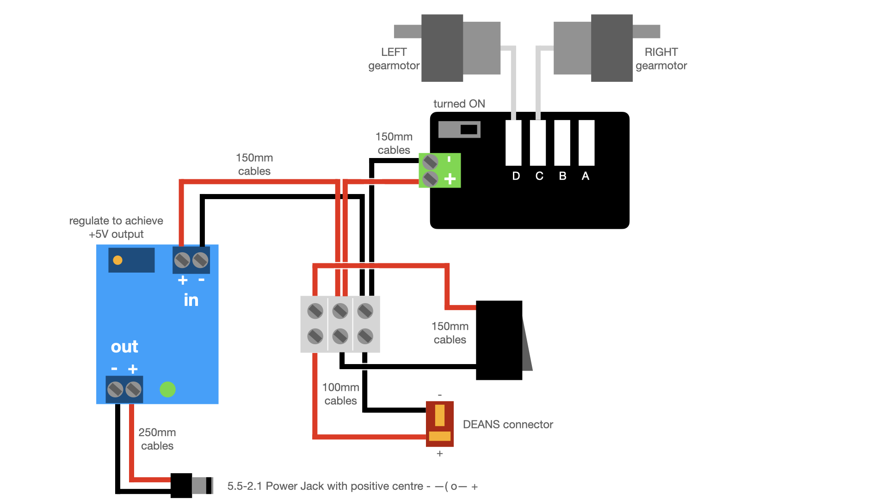
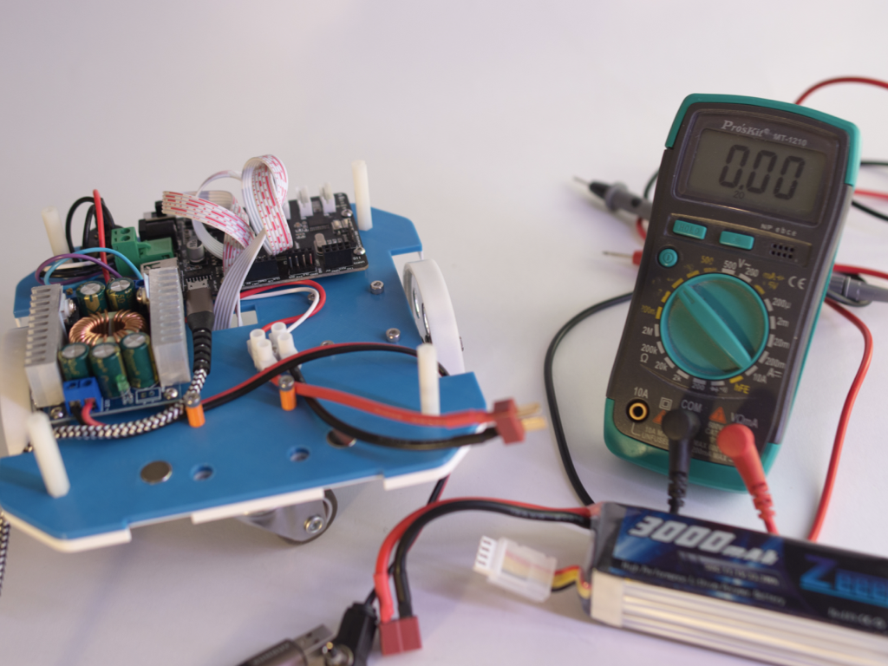
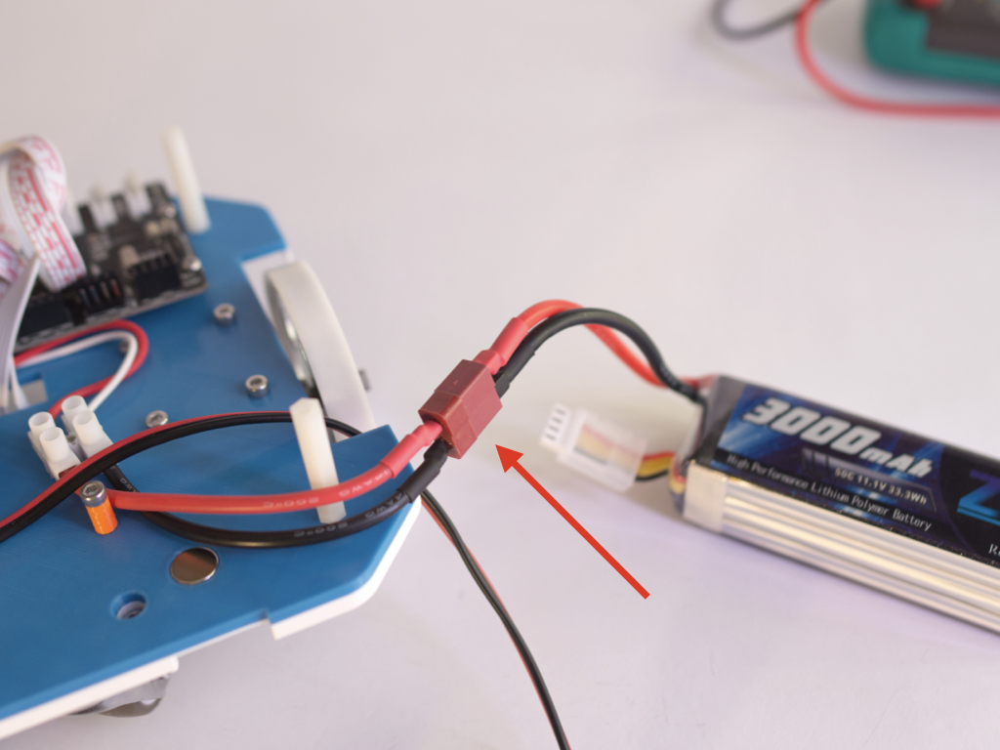
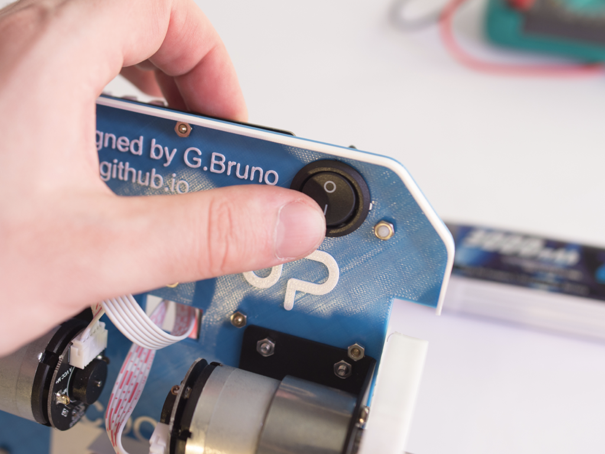
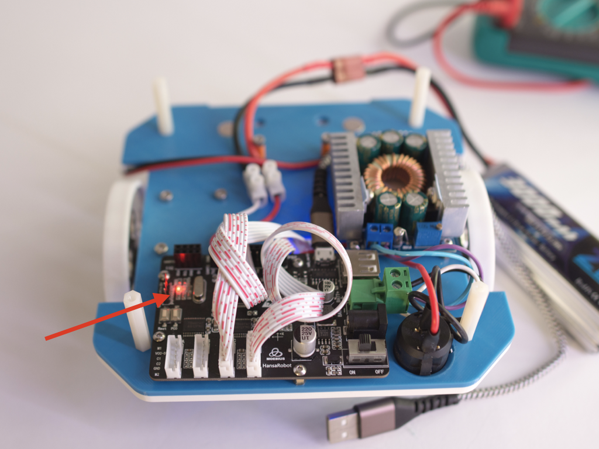
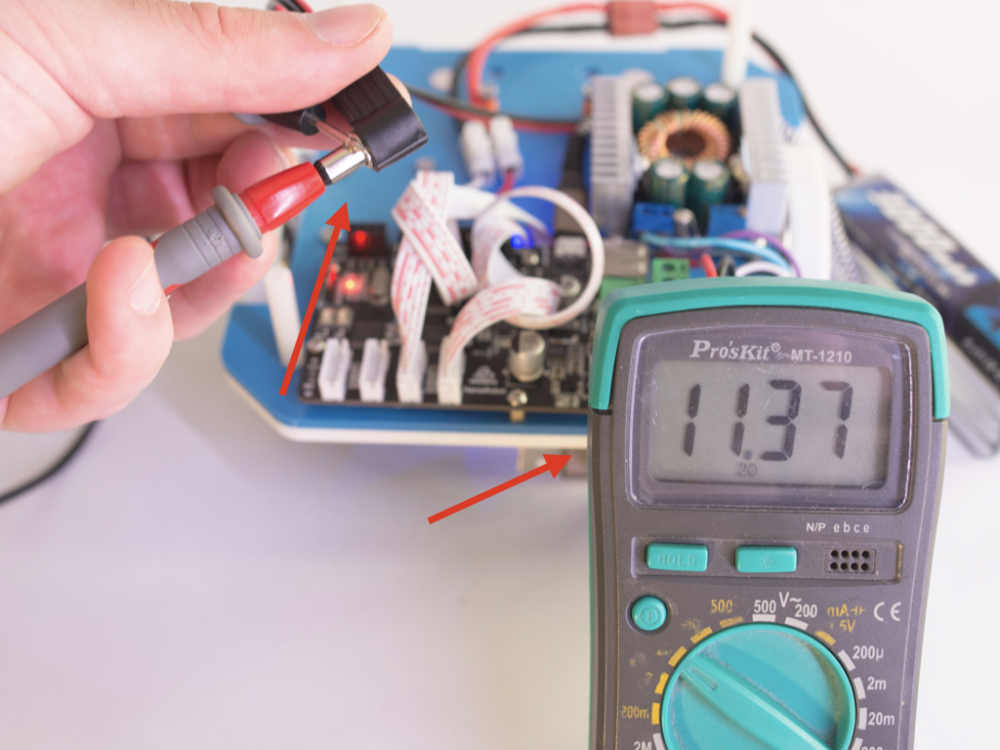
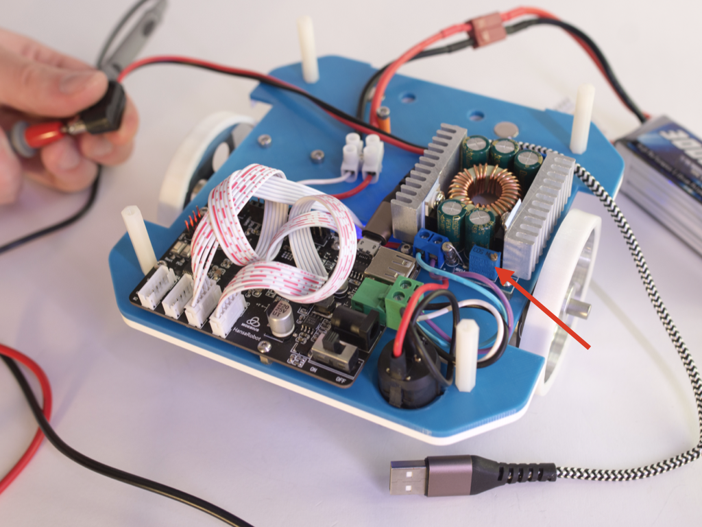
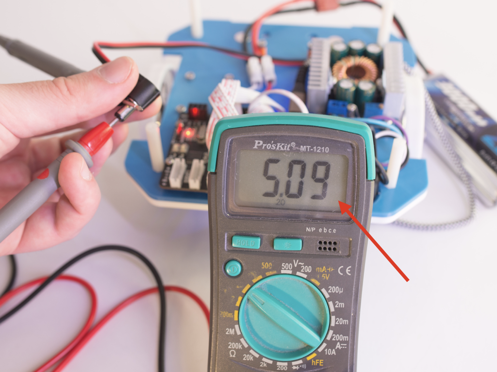
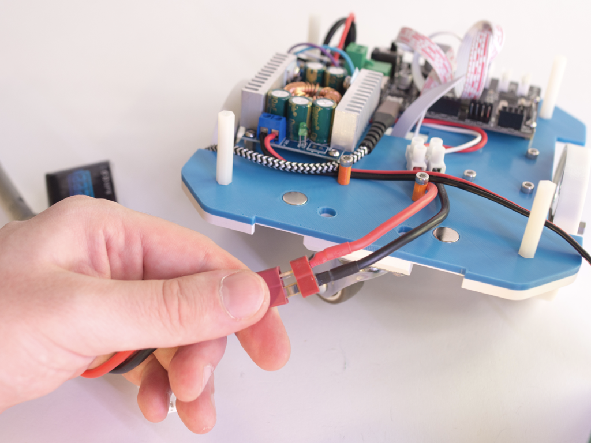

# Bottom plate setup

# 

## 1. List of the component needed in following steps

- Bottom plate (*code P01*)

- Moebiustech spacer (*code P04*)

- DCDC spacer (*code P05*)

- 4x M2.5 nuts (*code M03*)

- 8x M3 nuts (*code M04*)

- 14x M2.5x6 screws (*code M05*)

- 4x M2.5x14 screws (*code M06*)

- 12x M3x5 screws (*code M07*)

- 10x M3x10 screws (*code M08*)

- 2x Gearmotor brackets (*code M10*)

- 2x Wheels (*code M11*)

- 2x Magnets ⌀10x3 (*code M12*)

- Caster wheel (*code M13*)

- Moebiustech STM32 board (*code E04*)

- DCDC (*code E05*)

- 2x Gearmotor (*code E07*)

- 2x gearmotor cable (*code E08*)

- Power switch with cable (*code E09*)

- Power jack with cable (*code E10*)

- 22AWG cable (*code E11*)

- DEANS cable (*code E14*)

- Mammouth connector (*code E15*)

## 2. Mounting the bottom of the robot

Follow the video to mount the bottom section.

https://user-images.githubusercontent.com/9216366/146599040-81ecf0cd-299c-41ea-be90-967f67150cd5.mp4

## 3. Wiring

Following diagram shows how to wire the bottom section of the robot.

*Note: You can use longer cables*

Animation of the wiring

https://user-images.githubusercontent.com/9216366/146600231-4f52fe80-296f-4ad2-b1c7-9e365fd438a7.mp4

## 4. Calibrate the power stage

1. Now you need a voltmeter and a 3S LiPo battery. In following steps you will calibrate the DCDC buck converter

2. Connect the battery

3. Press the switch on the bottom of the robot to turn on (symbol **I**)

4. Check that board is turned on and red light is turned on, if not check the switch on the board that is setted on **ON**.

5. Measure voltage on the jack (central is positive)

6. Screw the tiny potenziometer until voltmeter shows something between 5V and 5.1V

7. You have just calibrated the power stage. Turn off by pressing the bottom switch and detach the battery.

---

## 5. Next step

[Go to the top plate building](3_top_plate_setup.md)

---

> ***Copyright © 2021 G. Bruno gbr1.github.io under MIT license***
