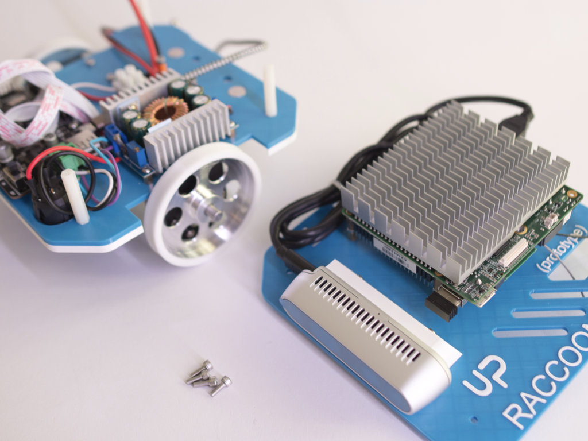

# Final assembly

# 

## 1. List of components required for next steps

- Bottom part of the robot

- Top part of the robot

- 4 M3x10 screws (*code M08*)

- 4 M3 nuts (*code M04*)

- USB 3.0 <-> USB C cable (*code E12*)

- USB 2.0 <-> micro USB (*code E13*)

- cable tie (*code M09*)

## 2. Mount the robot

Follow the video to mount the top section.

https://user-images.githubusercontent.com/9216366/146622010-1dc93084-384e-4ae7-ab8b-33d4da34a152.mp4

1. You need the two parts and 4 M3x8 screws

2. Mount the top part using the screws. Remember that camera and board must be aligned (it is the front)

3. Pass the usb cable from bottom to top and plug the usb connector on the back of UP Squared

4. Connect the jack into power input of UP Squared

5. Inser battery

6. Plug the DEANS connector

7. Attach the magnetic holder

## Finish!

Follow the [robot setup](../Raccoon robot setup.md) to start using your robot

> ***Copyright © 2021 G. Bruno gbr1.github.io under MIT license***
