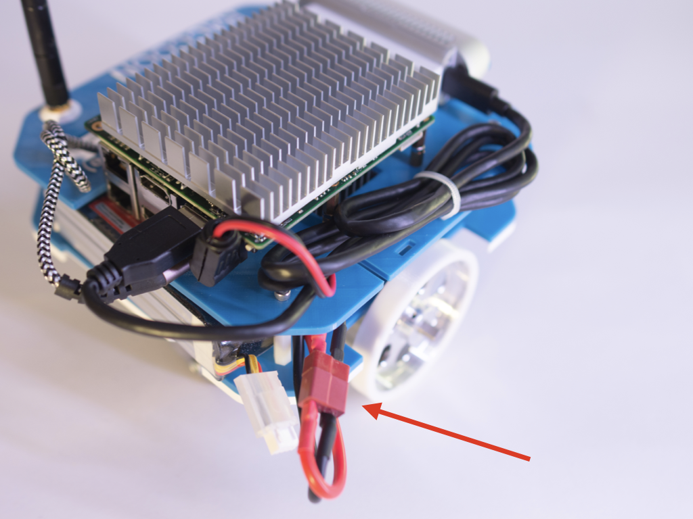

# Final assembly

# 

## 1. List of components required for next steps

- Bottom part of the robot

- Top part of the robot

- 4 M3x10 screws (*code M08*)

- 4 M3 nuts (*code M04*)

- USB 3.0 <-> USB C cable (*code E12*)

- USB 2.0 <-> micro USB (*code E13*)

- cable tie (*code M09*)

## 2. Mount the robot

1. Follow the video to mount the top section.

https://user-images.githubusercontent.com/9216366/146622010-1dc93084-384e-4ae7-ab8b-33d4da34a152.mp4

2. Plug the USB C cable (*code E12*) to the Intel Realsense and the USB 3.0 on the back of the robot. Fix the cable using the cable tie (*code M09*).

3. Pass the usb cable from bottom to top and plug the usb connector on the back of UP Squared

4. Connect the jack into power input of UP Squared

## 3. Battery

1. Insert the battery (3S LiPo)

2. Plug the DEANS connector

## 4. Optional - Battery holder

1. Insert magnets into the piece taking care of the polarity, the piece must be attracted by the bottom plate

2. Magnetically attach the holder

## Finish!

Your UP Raccoon is ready!

---

## Go to the software

Follow the [robot setup](../Raccoon robot setup.md) to start using your robot

---

> ***Copyright © 2021 G. Bruno gbr1.github.io under MIT license***
