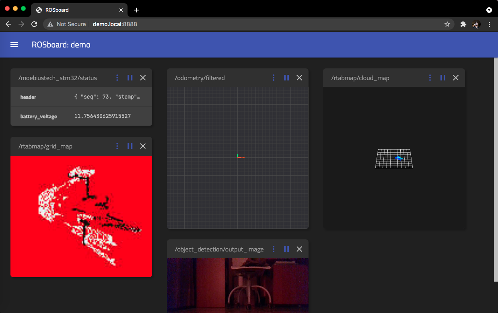

# How to use the demo

---

## 1.  Insert battery

Firstly you need to insert the battery.

Detach the magnetic bracket on the back of the robot.

Insert the battery, reattach the magnetic bracket and connect the DEANS connector.

## 2. Turn on

Check if the switch on Moebiustech board in turned on and turn on the switch on the bottom of the robot

You will see turning on:

- a red light on the Moebiustech board;

- a blue light for each motor

- a blue light on the back of the UP Squared

- a green light from the AI Core X (internal part of the robot)

- a little green light from the DC/DC

Now you have to wait that a blue light over the ethernet connector of UP Squared is turned on.

## 3.  Start the demo

When the robot is ready a blue light over the ethernet connector of UP Squared is turned on.

Automatically after about 1 second another light will turn on (it could be Red, Yellow or Green) that represent the battery state. Check the battery section of this guide to learn more.

Bring your smartphone, tablet or computer and check for a WiFi network called "raccoon-robot". Connect to this network by usign *robotdemo* password. 

In your favorite browser go to ***demo.local:8888*** and ROSBoard interface will appear.

## 4.  Use the demo

Press the menu button (the one with 3 lines) od ROSBoard and choose all topics you want to show.

If you always use the same device data will stored into your browser (check [saving already done configuration so that we cannot add everything again and again · Issue #76 · dheera/rosboard · GitHub](https://github.com/dheera/rosboard/issues/76))

Bring the joypad and press the central button (you will see a blue light on left).

Here a description of the controls:

- START: reset RTABmap

- B+left analog stick: move the robot at low speed (good to show SLAM)

- A+left analog stick: move the robot at medium speed

- X+left analog stick: move the robot at high speed (good to show how fast it is)

- SELECT+START+L+R: turn off

## 5.  Turn off

To turn off press SELECT+START+L+R simultaneously when joypad is connected.

Wait a while, you will see the power indicator on the UP Squared (the blue led on back right) turning off.

After that, turn off the general power switch on the bottom.

Detach the battery for security.

---

## Battery

When ROS is running on every second is published a topic */moebiustech_stm32/status* that contains the voltage value of the battery.

The battery_node in demo package shows on UP Squared leds the value of the battery. The color scheme is the following:

- GREEN, voltage ≥ 10.9V

- YELLOW, voltage ≥ 10.4V

- RED, voltage ≥ 10.2V

This node will turn off the UP Squared when 10.0V are reached as security mode.

To charge battery, detach from the robot connect to charger and select LIPO BALANCE 3S 1.8A program.

## Useful topics

- /camera/image_raw is the Realsense RGB sensor

- /camera/pointcloud/color is the Realsense pointcloud (enabled for the demo)

- /object_detection/image_raw is the mobilenetSSD view

- /rtabmap/cloud_map is the point cloud of the 3D environment that robot is learning

- /rtabmap/grip_map is the 2D projected map from the 3D SLAM

- /moebiustech_stm32/status is battery voltage

- /odometry/filtered is the UKF result of various odometry sources (visual odometry+wheels odometry)

- /dmesg if there are some errors.

---

## Troubleshooting

- If your robot turns off immediately:
  
  1. check battery voltage
  
  2. check if Moebiustech board is turned on

- If your robot can't be controller by joypad:
  
  1. check the manual of the joypad
  
  2. check if your joypad is in X mode
  
  3. check if your joypad is charged
  
  4. if you see only lag, wait a while and then retry. If persist check UP Squared temperature

- If object detection topic is absent or not work you must restart the robot (known issue of NCS2/Myriad X by Intel)

If you still encounter issues please send an email to [giovannididio.bruno@gmail.com](giovannididio.bruno@gmail.com)

> ***Copyright © 2021 G. Bruno gbr1.github.io under MIT license***
