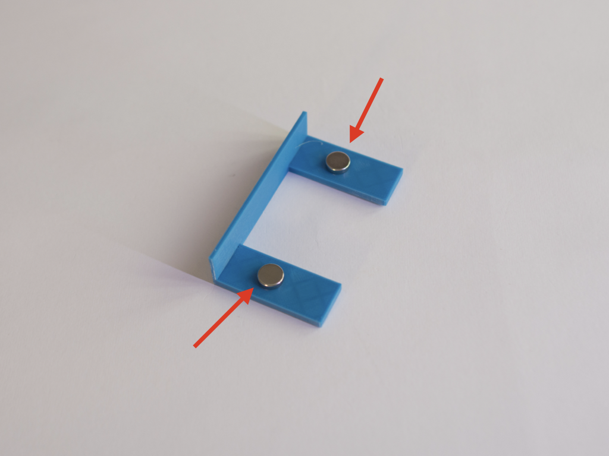
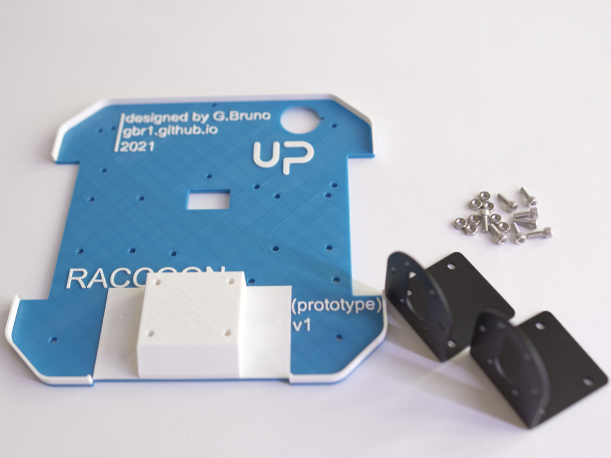
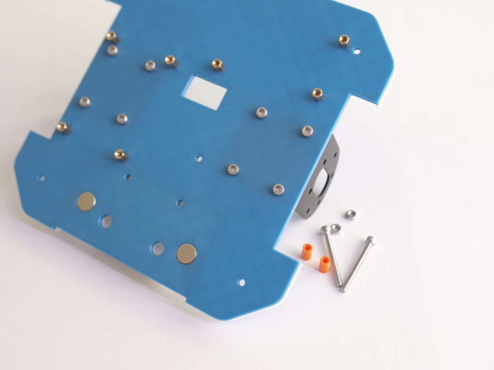
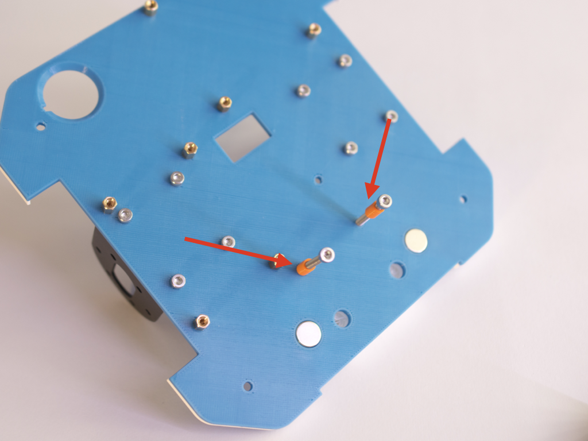
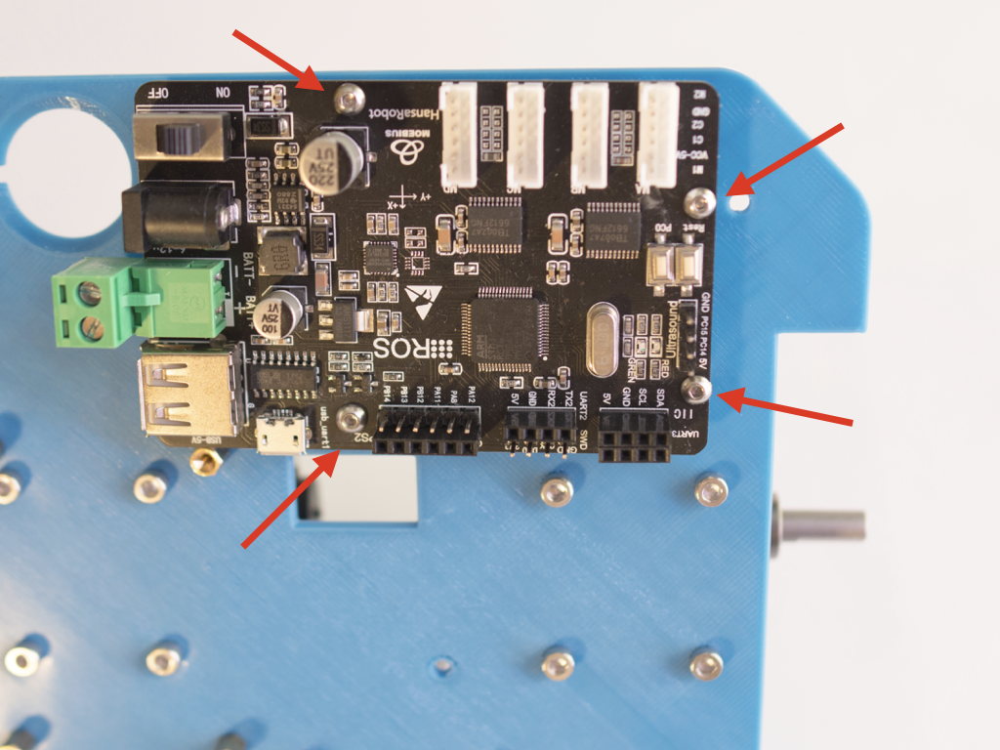
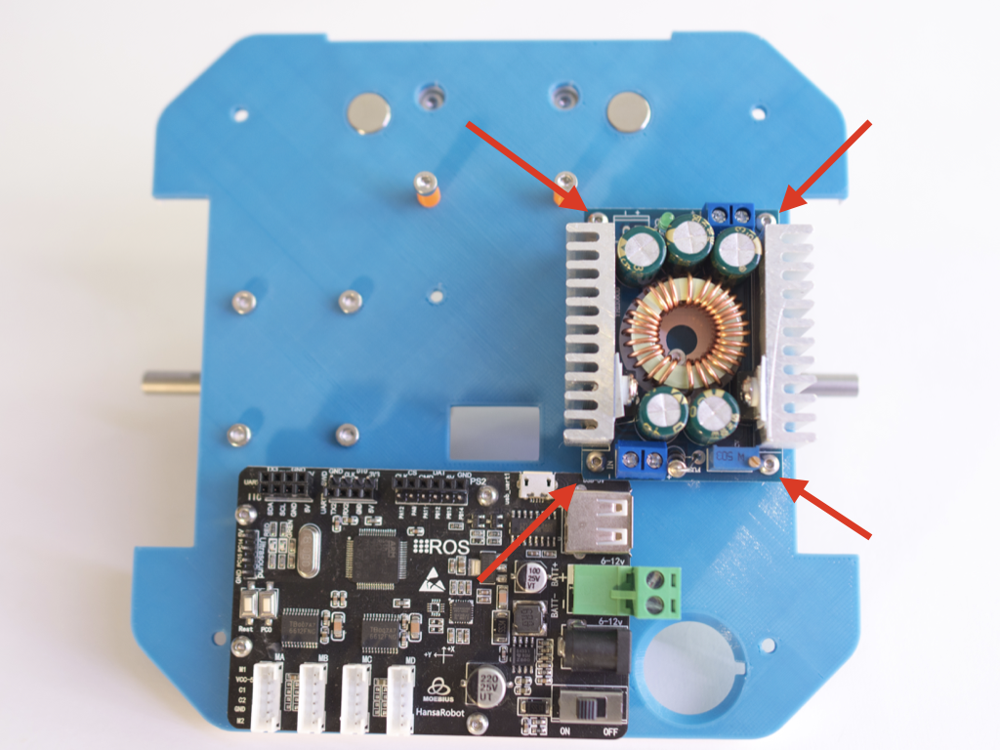
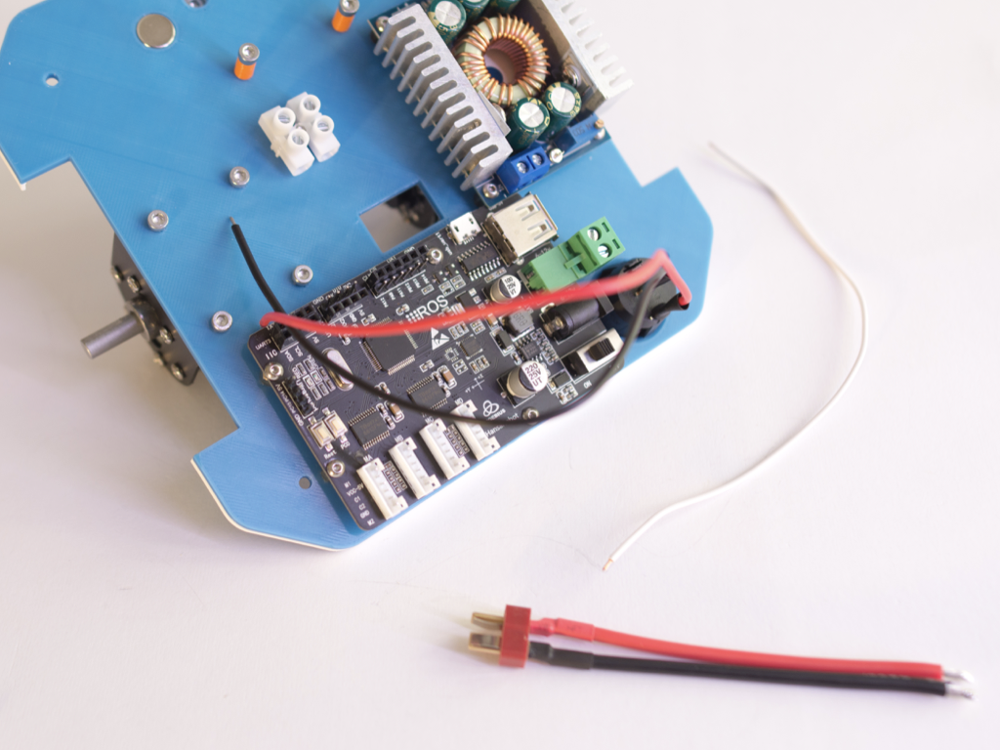
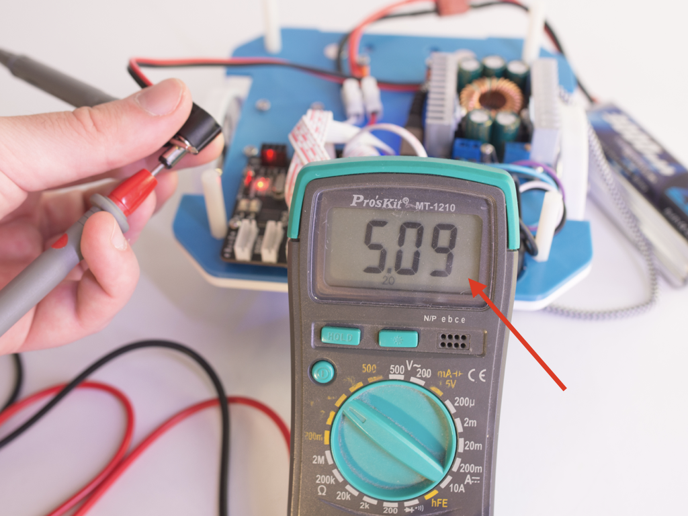
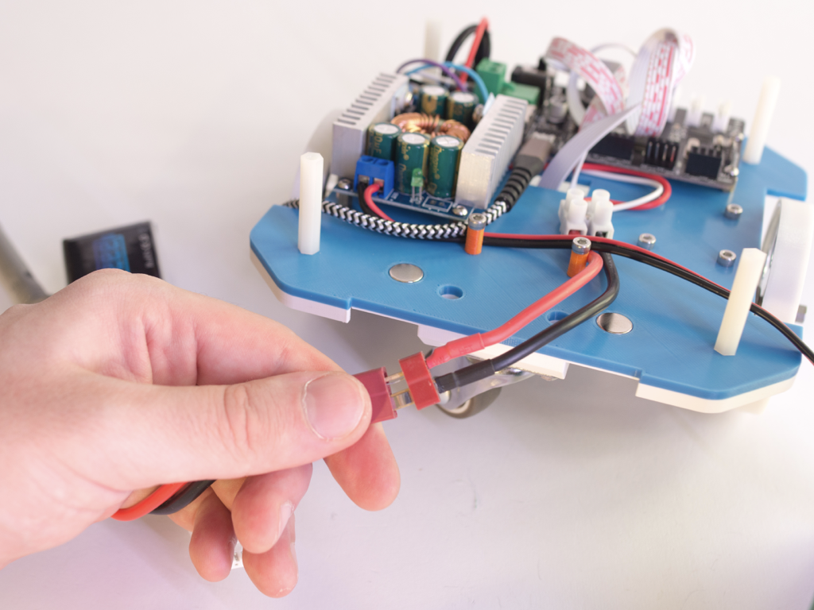

# Bottom plate setup

1. Fit 2 magnets into the 3d printed battery holder

2. Using the maded part check the correct orientation of the magnets to be mounted into the 3d printed bottom plate

3. Mount the magnets into the bottom plate

4. Check if everything is mounted correctly

5. Bring 8 M3x6 screws, 8 M3 nuts and motor brackets

6. Start mounting the brackets as shown

7. Mount all the screws and tight the nuts

8. Mount the other bracket, too

9. You should obtain something like the following photos

10. Bring 4 M2.5x5 standoffs and 4 M2.5 nuts

11. Place as shown

12. Fix with the nuts as shown

13. Bring 4 M2.5x6 standoffs and 4 M2.5 nuts

14. Place as shown

15. Fix with nuts

16. For next steps you need 2 M3x30 screws and 2 3d printed battery spacers

17. Insert the spacers into the screws

18. Screw the screws as shown

19. This is how it should appear

20. Bring 2 M3x14 screws, 4 M3 nuts and the caster wheel

21. Place the screws as shown

22. Screw until your part looks like the following photo 

23. Mount the caster wheel and fix using nuts

24. Now you need 2 motors and 12 M3x5 screws

25. Place motor as shown in photo (it must be on top) an fix using 3 screws

26. Now complete the motor by using other 3 screws

27. Mount the other motor, too

28. Bring the Moebiustech SMT32 board (you need to flash the firmware) and 4 M2.5x4 screws

29. Mount and fix using screws. Please check if it is aligned with the standoff

30. Now get the DCDC converter and 4 M2.5x4 screws

31. Mount as shown (led is on the back of the robot)

32. Now you need the power button

33. Mount from the bottom side, check the guide

34. Bring a M3x10 screw and an electrical screwed connector

35. Insert the screw from the bottom as shown

36. Mount the component on the top side

37. Now you need a DEANS cable and a 20cm white cable

38. Fix the two cables into the 2 parallel slots of the connector (check no shortcut)

39. Connect the red cable from the power switch to the red one of DEANS cable

40. Connect the white cable to the black one of DEANS cable

41. Now you need a cyan cable and a purple one

42. Fix the cyan and the white cable on the Moebiustech board negative (-) pole

43. Connect the black and the purple wire to positve (+) of Moebiustech board

44. Connect the purple cable to the input positive (+) of DCDC and the cyan to the negative input (-)

45. Bring the jack cable

46. Connect to the output of the DCDC, red is positive (+) and the black is negative (-)

47. For next steps you need 2 motor cables

48. Attach one cable for motor

49. Pass cables in the central slot

50. Attach the left motor to MOTOR D (left is viewing the robot from topand with the board on front)

51. Attach the right motor to MOTOR C

52. Now you need an usb micro cable

53. Plug the cable into the Moebiustech board

54. Pick 2 wheels

55. Mount wheels by screwing the hexagonal headed grain

56. Following photos shows the final result

57. Bring 4 M3x30 standoffs and 4 M3 nuts

58. Mount the standoffs as shown

59. Now you need a voltmeter and a 3S LiPo battery. In following steps you will calibrate the DCDC buck converter

60. Connect the battery

61. Press the button on bottom

62. Check that board is turned on and red light is turned on

63. Measure voltage on the jack (central is positive)

64. Screw the tiny potenziometer until voltmeter shows something between 5V and 5.1V

65. Turn off by pressing the bottom switch and detach the battery

66. The bottom plate is ready

> ***Copyright © 2021 G. Bruno gbr1.github.io under MIT license***
