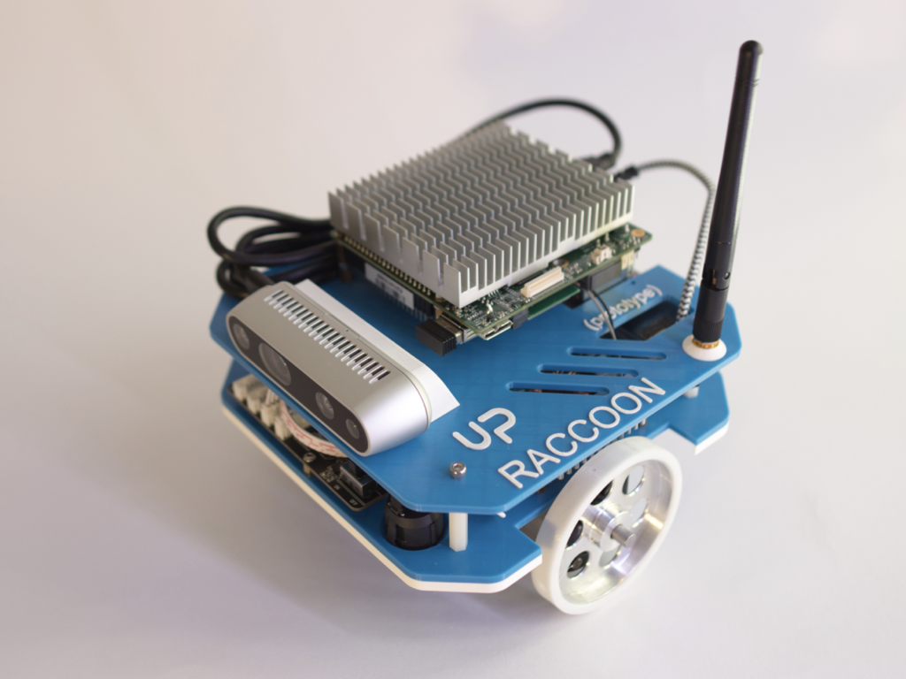

# Final assembly

1.  You need the two parts and 4 M3x8 screws

2.  Mount the top part using the screws. Remember that camera and board must be aligned (it is the front)

3.  Pass the usb cable from bottom to top and plug the usb connector on the back of UP Squared

4.  Connect the jack into power input of UP Squared

5.  Inser battery

6.  Plug the DEANS connector

7.  Attach the magnetic holder

8.  Remove the protection from D435i

9.  Your Raccoon robot is ready to use!

> ***Copyright © 2021 G. Bruno gbr1.github.io under MIT license***
